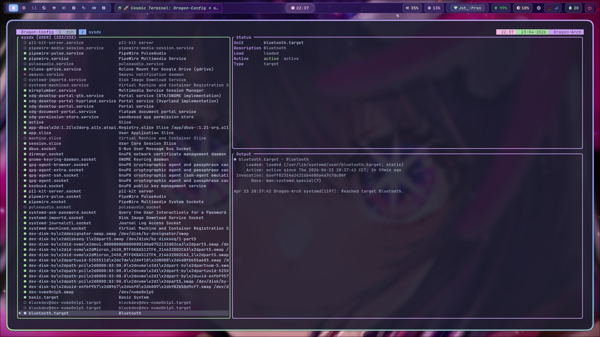
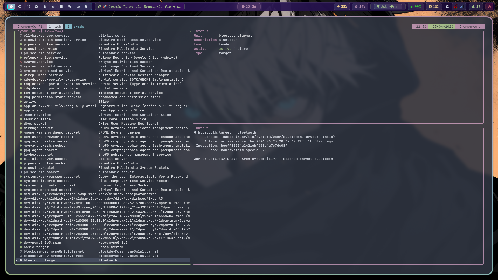

# sysdx

A terminal UI for managing systemd units. Navigate services with vim keybinds, filter with fuzzy search, and theme it with your own color palette.

## Features

- Two-pane layout: unit list on the left, status and journal output on the right
- Vim navigation: `j/k`, `g/G`, `ctrl-d/u`, `/` fuzzy filter
- Type filter — cycle through service / socket / timer / target / mount with `t`
- Toggle between user and system units with `tab`
- Action menu: start, stop, restart, enable, disable, reload, mask, unmask
- Confirmation prompt before destructive actions (stop, disable, mask)
- Full journal log view per unit with live-tail mode (`f` to toggle)
- Unit file viewer — `u` to view the unit file via `systemctl cat`
- Auto-refresh the unit list on a configurable interval
- Manual refresh with `r`
- Status bar showing mode-sensitive keybind hints and error messages
- In-app help overlay with `?`
- Non-blocking async I/O — systemctl calls never freeze the UI
- Theme via hex colors in config — ANSI fallback inherits your terminal palette automatically
- All keybinds rebindable in config

## Install

### Arch Linux (AUR)

```bash
paru -S sysdx        # or: yay -S sysdx
```

Pre-built binary (no Rust toolchain required):
```bash
paru -S sysdx-bin
```

### cargo

```bash
cargo install sysdx
```

### Build from source

```bash
git clone https://github.com/moxer-mmh/sysdx
cd sysdx
cargo build --release
sudo install -Dm755 target/release/sysdx /usr/local/bin/sysdx
```

## Usage

```bash
sysdx              # start with user units (default)
sysdx --system     # start with system units
sysdx --help       # show help
sysdx --version    # show version
```

## Keybinds

| Key | Action |
|-----|--------|
| `j` / `k` | Navigate down / up |
| `g` / `G` | Go to top / bottom |
| `ctrl-d` / `ctrl-u` | Half-page down / up |
| `/` | Open fuzzy filter |
| `t` | Cycle type filter (service → socket → timer → …) |
| `enter` | Open action menu |
| `tab` | Toggle user ↔ system scope |
| `l` | View journal logs (`f` to toggle live-tail) |
| `u` | View unit file (`systemctl cat`) |
| `r` | Refresh unit list |
| `?` | Show keybind help |
| `q` | Quit |

All keybinds are rebindable in `~/.config/sysdx/config.toml`.

## Configuration

Copy the example config to get started:

```bash
mkdir -p ~/.config/sysdx
cp /usr/share/doc/sysdx/config.example.toml ~/.config/sysdx/config.toml
```

Or create it from scratch — any missing key uses the default value.

### `~/.config/sysdx/config.toml`

```toml
[display]
journal_lines      = 50     # journal lines in log view
tick_rate_ms       = 250    # event poll interval (ms)
show_description   = true   # show unit description in list
list_width_pct     = 40     # left pane width % (20–70)
auto_refresh_secs  = 0      # auto-refresh interval; 0 = disabled
confirm_destructive = true  # confirm before stop/disable/mask

[keybinds]
move_down      = "j"
move_up        = "k"
page_down      = "ctrl-d"
page_up        = "ctrl-u"
go_top         = "g"
go_bottom      = "G"
filter         = "/"
type_filter    = "t"
action_menu    = "enter"
switch_scope   = "tab"
open_logs      = "l"
open_unit_file = "u"
refresh        = "r"
help           = "?"
quit           = "q"

[colors]
# Hex strings (#rrggbb). Comment out any key to use terminal ANSI fallback.
# If no colors are set, sysdx inherits your terminal's current palette,
# so theme managers like wallust work automatically.
background     = "#0a0a0f"
surface        = "#1a1a2e"
border         = "#8844ff"
border_focused = "#00ff88"
text           = "#e0e1e5"
text_dim       = "#b4a7d6"
selection_bg   = "#2a2a40"
selection_fg   = "#ffffff"
active         = "#00ff88"
inactive       = "#b4a7d6"
failed         = "#ff0088"
filter_bar     = "#ffaa00"
header         = "#8844ff"
```

### Theme integration

If you use a terminal theme manager (wallust, pywal, etc.), you can leave the `[colors]` section empty or remove it entirely. sysdx will use your terminal's ANSI palette, which is already set by your theme manager.

To set exact hex colors from your palette, copy the values into `[colors]`. This gives pixel-perfect matching regardless of terminal.

## Screenshots

<table>
  <tr>
    <td></td>
    <td></td>
  </tr>
  <tr>
    <td></td>
    <td></td>
  </tr>
</table>

## Contributing

Issues and pull requests are welcome at [github.com/moxer-mmh/sysdx](https://github.com/moxer-mmh/sysdx).

## License

MIT — see [LICENSE](LICENSE).
